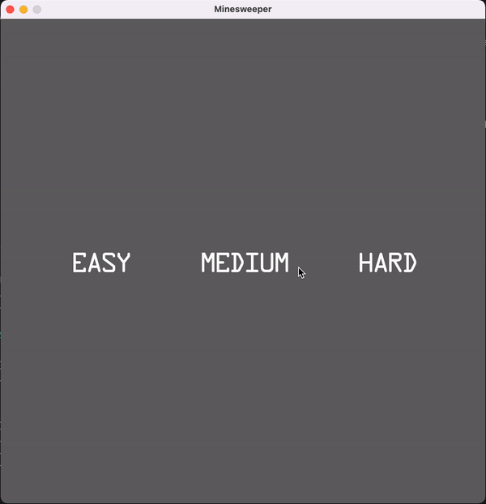

# Minesweeper in Bevy
This is an attempt at implementation of the classic Minesweeper game in the [Bevy](https://github.com/bevyengine/bevy) game engine, using the [bevy_mod_picking](https://github.com/aevyrie/bevy_mod_picking/) plugin.

Here is how it looks like:



## Assets
- All GLTF bundles were taken from [Kenney](https://www.kenney.nl). Just like in Bevy   examples.
- [Smiley](https://www.flaticon.com/free-icon/smile_742751) icon
- Fonts were taken from [1001 FreeFonts](https://www.1001freefonts.com)

## Requirements
- Rust >= 1.57 (tested with)
- (optional) `basic-http-server`

## Building
Since it's a rather simple Rust project, building it is also very simple.
### Native
```
minesweeper# cargo build --release 
```
### WASM
```
minesweeper# wasm-pack build --target web --release
```

## Running
### Native
```
minesweeper# cargo run --release
```
### WASM
- Create a directory you will run your HTTP-server from
  ```
  minesweeper# mkdir -p </path/to/dir> && mkdir -p </path/to/dir>/assets
  ```
- Copy `assets/{models,fonts,icons}` directories
  ```
  minesweeper# cp -R assets/{models,fonts,icons} </path/to/dir>/assets
  ```
- Copy `pkg/` files
  ```
  minesweeper# cp pkg/* </path/to/dir>
  ```
- Copy `assets/html/index.html`
  ```
  minesweeper# cp assets/html/index.html </path/to/dir>
  ```
- Run the HTTP-server
  ```
  minesweeper# basic-http-server <path/to/dir>
  ```

## License
Minesweeper is published under a [MIT License](/LICENSE.md).

## TODO
- [ ] Cleanup
- [ ] Camera position to be relative to the field size
- [ ] Animations
- [ ] Performance (currently the app seems to be quite heavy)
- [ ] Store scores
- [ ] Code's TODO/FIXME